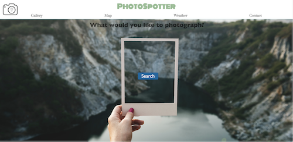
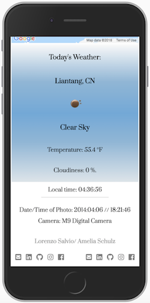

# PhotoSpotter            

- An interactive Web App that gives users the power to recreate their favorite pictures by giving them the location, time and camera information of the image, as well as local weather. The user can input the subject they would like to photograph and instantly be transported to a gallery of their specified interest. With one  click of an image, the user will immediately receive all the necessary information to create a similar photo.

### Authors
- Lorenzo Salvio 
- Amelia Schulz

### Technologies Used:
 - HTML5, CSS3, CSS Flexbox, JavaScript
 
### APIs Used: 
 - Flickr API 
    - Keyword search and populating gallery
    - Image location and metadata (when available).
 - Google Maps API
    - Plotting locations based on coordinates received from Flickr.
 - OpenWeather API
    - Getting local weather information.
 - TimeZoneDB API 
    - Getting local time for each location.

[Demo Page](http://ec2-18-191-246-225.us-east-2.compute.amazonaws.com/)

## Landing Page

## Gallery

## Map

## Weather

### Obstacles

- Extracting and assigning data to each individual image
- Refactoring the UI to be more user friendly 

### Future Additions
- Google maps with directions to direct users to their photo location
